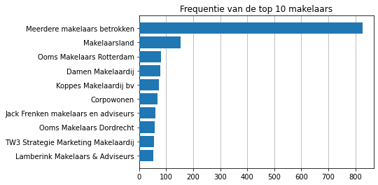
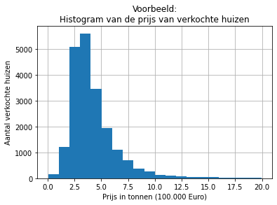
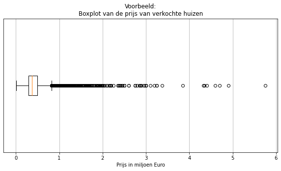

---
jupyter:
  jupytext:
    formats: py:light,ipynb,md
    text_representation:
      extension: .md
      format_name: markdown
      format_version: '1.3'
      jupytext_version: 1.13.7
  kernelspec:
    display_name: Python 3 (ipykernel)
    language: python
    name: python3
---

# Imports

```python
from pathlib import Path

import matplotlib.pyplot as plt
import pandas as pd
```

# Constanten

```python
CWD = Path(".").absolute()
DATA_DIR = CWD / "data"
```

# Data inladen

```python
df_ruw = pd.read_csv(DATA_DIR / "dataset_huizen.csv")
df_ruw.head()
```

# Opdracht 1: Dataselectie
1. Toon het aantal rijen in de dataset ([klik hier voor een hint](./hints/hint_1.1.md)).
2. Toon het aantal kolommenin de dataset ([hint](./hints/hint_1.2.md)).
3. Toon de rijen 15 tot 20 ([hint](./hints/hint_1.3.md)).
4. Toon de kolom `price` in een `series` ([hint](./hints/hint_1.4.md)).
5. Toon de kolom `price` in een `DataFrame` ([hint](./hints/hint_1.5.md)).
6. Toon de kolommen `price` en `spatial_info` in één `DataFrame` ([hint](./hints/hint_1.6.md)).
7. Toon rijen 15 tot 20 van de kolommen `price`, `spatial_info`, `address1` en `address2` in die volgorde in één `DataFrame` ([hint](./hints/hint_1.7.md)).
8. Toon rijen 50 tot 55 van de eerste 9 kolommen ([hint](./hints/hint_1.8.md)).


# Opdracht 2: Eerste visualisatie
1. Reproduceer de onderstaande grafiek ([hint](./hints/hint_2.1.md)):




# Opdracht 3: Data-extractie en visualisatie van prijzen
1. Extraheer de prijzen uit de kolom `price` ([hints](./hints/hint_3.1.md)).
2. Geef een histogram weer van de prijzen ([hints](./hints/hint_3.2.md)).
3. Geef een boxplot weer van de prijzen ([hints](./hints/hint_3.3.md)).





# Opdracht 4: Meer extractie en visualisatie
1. Extraheer de woonplaatsen en postcodes uit bijvoorbeeld `address2`.
2. Maak door middel van een grafiek duidelijk in welke 10 woonplaatsen de meeste huizen zijn verkocht.
3. Geef ook weer wat de gemiddeld verkoopprijs was in die 10 woonplaatsen.
4. Welke postcode heeft de hoogste gemiddelde verkoopprijs?
5. En wat als je alleen de cijfers van de postcode gebruikt?
6. Extraheer het woonoppervlak, perceeloppervlak en het aantal kamers uit bijvoorbeeld `spatial_info`.
7. Plot `plt.scatter()` plots die de correlatie laten zien tussen de prijs en deze drie nieuwe variabelen.


# Opdracht 5: Data analyse
1. Onderzoek de uitschieters in de prijzen en oppervlakten. Zijn alle verkochte objecten huizen?
2. Maak de hiervoor gemaakte visualisaties nogmaals, maar dan gesplitst over de soorten objecten.
